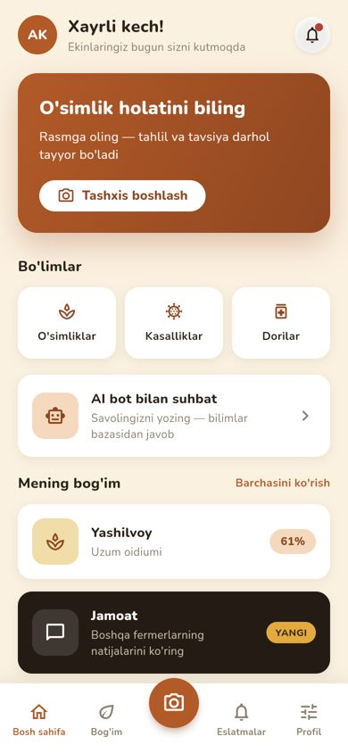
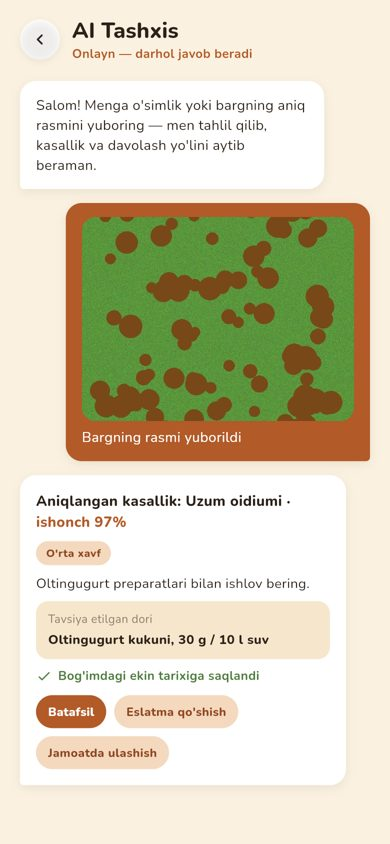
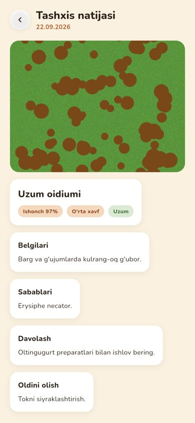
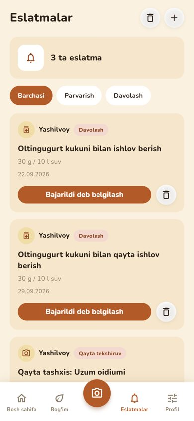
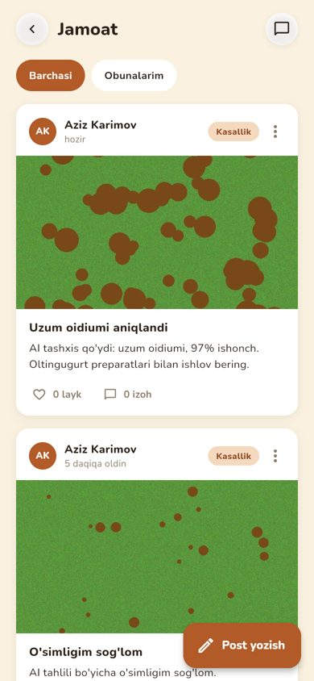
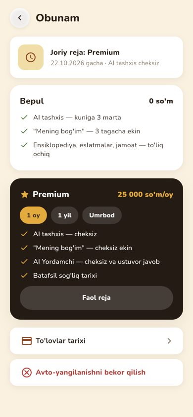

# AgroYordam 0.1

AI yordamida qishloq xo'jaligi ekinlari kasalliklarini tashxislaydigan **mobil va web** platforma:
fermer barg rasmini yuklaydi → AI kasallikni aniqlaydi → bilimlar bazasidan belgilar, sabab, davolash,
oldini olish va tavsiya etilgan dorilar ko'rsatiladi. Qo'shimcha: "Mening bog'im", sog'liq monitoringi,
eslatmalar, jamoat, real-time chat, AI yordamchi, Premium obuna va admin panel.

| Bosh sahifa | AI tashxis | Tashxis natijasi | Eslatmalar | Jamoat | Premium |
|---|---|---|---|---|---|
|  |  |  |  |  |  |

## Tarkib

```
backend/      FastAPI (modular monolith), SQLAlchemy 2.0 async, Alembic, JWT + bcrypt, WebSocket, APScheduler
ai-service/   Ichki AI mikroservis: rasm validatsiyasi (o'lcham, yorug'lik, Laplacian blur, o'simlik bor-yo'qligi)
              + model interfeysi (MVP: deterministik stub, ONNX model tayyor bo'lganda avtomatik almashadi)
mobile/       Flutter ilova — Android, iOS va Web (bitta kod bazasi), Riverpod + go_router, Clean Architecture
deploy/       Nginx konfiguratsiyasi (reverse proxy, rate limit, WebSocket)
docker-compose.yml, .env.example, .github/workflows/ci.yml
```

## Tez ishga tushirish

### Docker bilan (butun tizim bitta buyruqda)

```bash
cp .env.example .env        # kerak bo'lsa qiymatlarni o'zgartiring
docker compose up --build
```

- Ilova (web): http://localhost
- API hujjatlari (Swagger): http://localhost/docs
- MinIO konsol: http://localhost:9001

### Docker'siz (dasturlash uchun)

```bash
# 1) AI service
cd ai-service && pip install -r requirements.txt && uvicorn app.main:app --port 8001

# 2) Backend (standart holatda SQLite; PostgreSQL uchun DATABASE_URL bering va `alembic upgrade head`)
cd backend && pip install -r requirements-dev.txt && uvicorn app.main:app --port 8000

# 3) Flutter ilova
cd mobile && flutter pub get
flutter run -d chrome --dart-define=API_URL=http://localhost:8000   # web
flutter run -d android                                               # emulyator (10.0.2.2:8000)
```

### Android APK (telefonda sinash)

APK har push'da GitHub Actions ("Android APK" workflow) tomonidan yig'iladi va **Releases → v0.1.0** sahifasiga
`AgroYordam-0.1.apk` nomi bilan yuklanadi.

1. Backend'ni kompyuterda tarmoqqa ochiq holda ishga tushiring: `uvicorn app.main:app --host 0.0.0.0 --port 8000`
   (AI service ham ishlab turishi kerak).
2. Telefon va kompyuter bitta Wi-Fi'da bo'lsin. APK'ni o'rnating.
3. Ilovaning birinchi ekranida pastdagi **"Server: ..."** tugmasini bosing va kompyuter IP manzilini kiriting,
   masalan `http://192.168.1.10:8000` → "Tekshirish" → "Saqlash".

### Demo hisoblar (faqat dev, `SEED_DEMO_DATA=true`)

| Rol | Login | Parol |
|---|---|---|
| Admin | `admin` | `Admin12345!` |
| Fermer | `dilnoza` | `Demo12345!` |
| Fermer | `sardor` | `Demo12345!` |

## Imkoniyatlar

- **Auth**: ro'yxatdan o'tish / kirish (email, telefon yoki username), refresh token rotatsiyasi (DB'da, bekor qilinadi),
  parolni tiklash, RBAC (`user`, `moderator`, `admin`).
- **AI tashxis**: rasm → validatsiya → AI → bilimlar bazasi (`diseases.ai_label`) → `diagnoses` jadvaliga saqlash,
  ekin sog'lig'i avtomatik yangilanadi, past ishonchda qayta suratga olish tavsiyasi.
- **Mening bog'im**: ekinlar CRUD, sog'liq tarixi grafigi, ekin kundaligi, qayta tashxis.
- **Eslatmalar**: qo'lda yoki tashxisdan avtomatik davolash rejasi; APScheduler vaqti kelganda bildirishnoma yuboradi.
- **Jamoat**: postlar (rasm bilan), layk, izoh, obuna (follow), shikoyat; tashxisni bir tugma bilan ulashish.
- **Chat**: 1:1 real-time chat (WebSocket), "yozmoqda..." va o'qilganlik belgisi, bildirishnomalar WebSocket'i.
- **AI yordamchi**: bilimlar bazasiga tayangan erkin savol-javob (kunlik limit bilan).
- **Premium**: Payme / Click / Uzum Bank; webhook HMAC imzo tekshiruvi; bepul reja — kuniga 3 ta AI tashxis va 3 tagacha ekin.
- **Admin panel** (Flutter Web'da keng ekran): platforma / AI / daromad statistikasi, foydalanuvchilarni bloklash,
  katalog (o'simlik, kasallik, dori va ularni bog'lash) CRUD, shikoyatlarni moderatsiya qilish.

## Testlar

```bash
cd backend && pytest --cov=app          # 31 ta test, coverage ~95%
cd ai-service && pytest                 # 9 ta test
cd mobile && flutter analyze && flutter test
```

CI (GitHub Actions) har push'da: PostgreSQL'da Alembic migratsiyasi, backend testlari (coverage ≥70%),
AI service testlari, `flutter analyze`, `flutter test` va `flutter build web`.

## Hozircha nima qilinmagan (keyingi bosqichlar)

- **Haqiqiy AI model**: `ai-service/training/train.py` (EfficientNet-B0 → ONNX) tayyor, lekin model dataset
  (PlantVillage + mahalliy rasmlar) bilan hali o'qitilmagan. Hozir stub ishlaydi; `MODEL_PATH` berilganda real model ulanadi.
- **To'lov provayderlari**: `PAYMENT_MODE=sandbox` — ilova ichida test to'lov. Live rejim uchun Payme/Click/Uzum
  merchant kalitlari va har bir provayderning rasmiy webhook protokoli (Payme JSON-RPC, Click prepare/complete) kerak.
- **Push-bildirishnomalar**: FCM kaliti (`FCM_SERVER_KEY`) va Firebase loyihasi berilganda yoqiladi.
- **SMS / email** orqali parol tiklash kodi yuborish (hozir dev rejimida kod javobda qaytadi).
- Load test va prod uchun TLS sertifikati.

## Dizayn

Ranglar, shrift (Nunito), kartalar va ekranlar tuzilishi berilgan dizayn maketiga mos. Barcha ranglar
`mobile/lib/core/theme/app_colors.dart` faylida jamlangan (boshqa joyda hardcoded hex yo'q), yorug' va qorong'i
mavzular qo'llab-quvvatlanadi.
