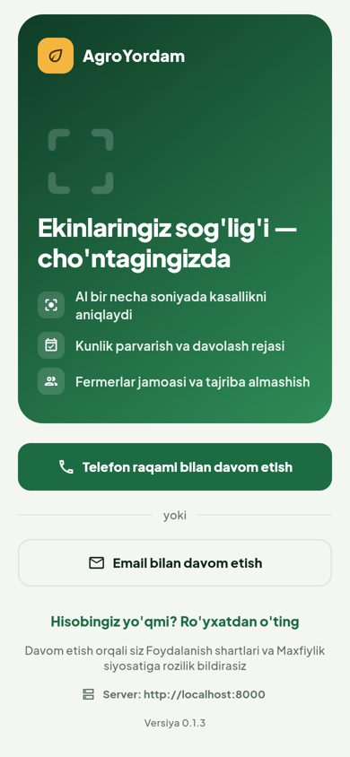
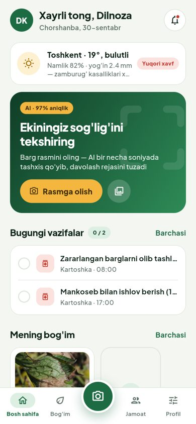
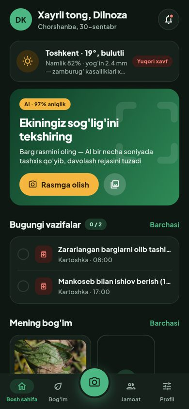
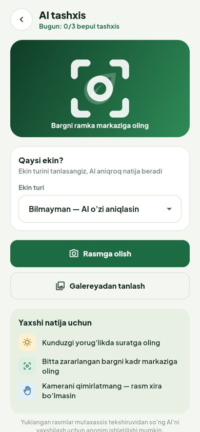
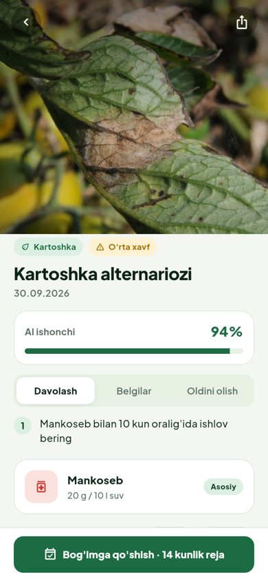
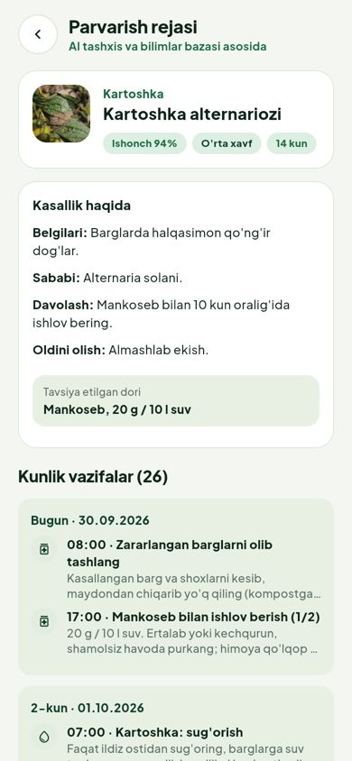
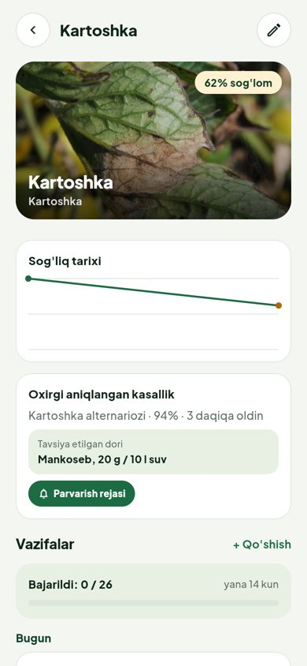

# Dizayn tizimi — "Yashil dala"

**Figma:** https://www.figma.com/design/u8uKZVrPaO6yOaaCkwCLsv

| Sahifa | Nima bor |
|---|---|
| 01 · Yo'nalishlar | A · Tuproq va B · Yashil dala taqqoslanishi (bosh sahifa, tashxis natijasi). **B tanlangan.** |
| 02 · Dizayn tizimi | Ranglar (Light/Dark), tipografiya, radius, oraliqlar; 30 ta ikonka; `Button`, `Chip` komponentlari |
| 03 · Ekranlar | (davom ettiriladi) |

Figma o'zgaruvchilari: `Color · Light`, `Color · Dark` (Starter tarifida bitta kolleksiyada bitta rejim), `Dimensions`.
Koddagi manba: `mobile/lib/core/theme/app_colors.dart` va `app_theme.dart` — boshqa joyda hardcoded rang yo'q
(istisno: gradient bannerlar, ular ikkala mavzuda bir xil).

## Tokenlar

| Token (Figma) | Kod (`context.c.…`) | Light | Dark |
|---|---|---|---|
| bg/canvas | `cream` | `#F3F6F1` | `#0E1712` |
| bg/surface | `card` | `#FFFFFF` | `#16211B` |
| bg/surface-muted | `cream2` | `#E8F0E4` | `#1E2C24` |
| border/default | `border` | `#DDE6DA` | `#2A3A31` |
| brand/primary | `primary` | `#1D6B43` | `#4CB782` |
| brand/primary-deep | `primaryDark` | `#0F3D27` | `#A7E3C4` |
| brand/primary-soft | `primaryLight` | `#DCEFE2` | `#1C3A2A` |
| brand/accent | `gold` / `onGold` | `#F4B63E` / `#3A2A00` | `#F4B63E` / `#2A1E00` |
| text/primary · secondary · tertiary | `text` · `muted` · `subtle` | `#0F2419` · `#5C6E64` · `#8A9A91` | `#EAF2EC` · `#9FB2A7` · `#6F8378` |
| status/danger · warning · info · success | `danger` · `warning` · `info` · `success` (+ `…Bg`) | | |

**Radius:** sm 10 · md 14 (tugma, maydon) · lg 20 (karta) · xl 28 (panel, bottom sheet).
**Oraliqlar:** 8pt panjara (4 · 8 · 12 · 16 · 20 · 24 · 32), ekran chetidan 20.
**Shrift:** Plus Jakarta Sans (OFL, `mobile/assets/fonts`) — Display 28/34, H1 24/30, H2 20/26, H3 17/24, Body 15·14·13, Label 15·13.5, Caption 12.

## Qoidalar

- Kartalar — oq sirt + 1px `border`, soyasiz. Rangli (muted, soft) kartalar chegarasiz.
- Sahifada bitta asosiy (Primary) tugma. AI/kamera harakati — Accent (sariq). Ikkinchi darajali — Outline.
- Holat ranglari faqat ma'no uchun: yashil — sog'lom/bajarildi, to'q sariq — o'rta xavf, qizil — yuqori xavf/davolash, ko'k — sug'orish.
- Oq fonda sariq matn ishlatilmaydi (kontrast) — o'rta holat matni `warning`.
- To'q sirtlar (`dark`) ustidagi matn `onDark` — kontrast ≥ 4.5 (testda tekshiriladi).
- Pastki menyu: Bosh sahifa · Bog'im · [kamera] · Jamoat · Profil; faol bo'lim yumshoq yashil pill ichida.

## Ekranlar (0.1.4)

| Kirish | Bosh sahifa | Qorong'i | AI tashxis | Natija | Parvarish rejasi | Ekin |
|---|---|---|---|---|---|---|
|  |  |  |  |  |  |  |
